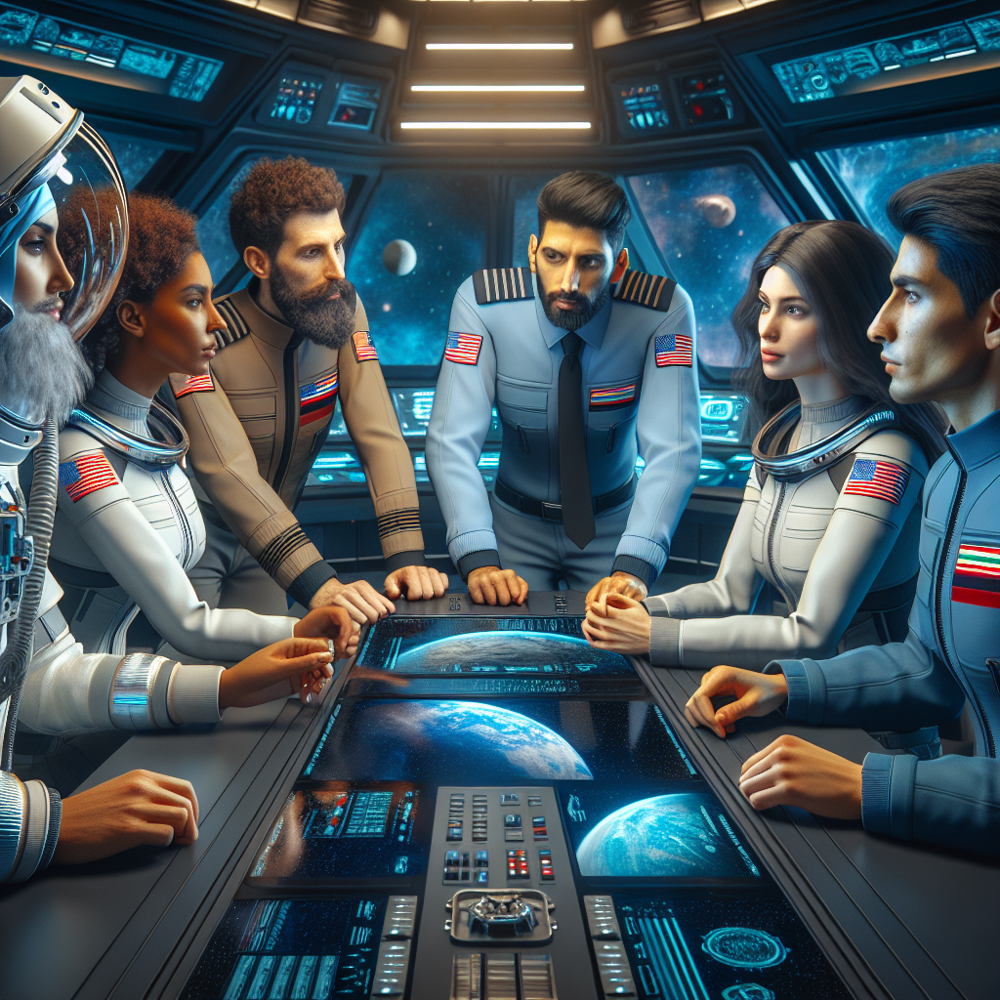

# Challenge 02 - Make spaceship great again

[< Previous Challenge](Challenge-01.md) - [Home](../README.md) - [Next Challenge >](Challenge-03.md)

## Introduction

The Quantum Seeker had successfully launched into the vastness of space, leaving Earth behind as it headed toward the Alpha Centauri system. The crew was settling into their routines, the hum of the ship's systems providing a comforting background noise. Captain Amina Valdez, who had led the mission with unwavering confidence, was overseeing the ship's navigation from the bridge. However, just a few hours into their journey, Captain Valdez began to feel unwell. At first, she dismissed it as mere fatigue from the intense preparations and launch, but the symptoms quickly escalated. She felt dizzy, her vision blurred, and a sharp pain shot through her head and she fainted. A hushed silence fell over the room. The weight of the situation was palpable. The mission was too critical to be jeopardized, and they needed a new leader to guide them through the unknowns of deep space. 

  

## Description

Spaceship mission is too important to have crucial code being distributed here and there. Let's follow a consolidated approach.

- First, define a person who is going to be hosting a central repo for the team and agree on the name of the repo (hint: name of your spaceship!)
- Next, ensure that the **main** branch of the spaceship repository is protected to prevent any crew members from bypassing the Pull Request process. We cannot afford to take such risks.
- Finally, all crew members should create their **own** **folders** containing crew member data in that repo (remember, no direct pushes!)

Example:

MyRepo/ElenaKim/profile.md

```hcl
resource "spaceship_crew_member" "elena_kim" {
  name        = "Elena Kim"
  experience  = "15 years"
  specialty   = "Space Medicine"
}
```

## Success Criteria

- There is a central repo for team
- Main branch is protected from direct push, and pull request requires minimum 2 reviewers to be approved!
- Each crew member has their folder containing crew member data in the repo added via pull request


### Hints
- You don't need to create Codespaces per branch, just create it on main. You can create branches and do pull requests within the codespace.
- Review pull requests in GitHub UI, there it is implemented better, Codespaces are a bit confusing.

## Learning Resources

- [Manage branch protection](https://docs.github.com/en/repositories/configuring-branches-and-merges-in-your-repository/managing-protected-branches/managing-a-branch-protection-rule)
- [Inviting collaborators to a personal repository](https://docs.github.com/en/account-and-profile/setting-up-and-managing-your-personal-account-on-github/managing-access-to-your-personal-repositories/inviting-collaborators-to-a-personal-repository)
- [Creating a pull request in Codespaces](https://docs.github.com/en/pull-requests/collaborating-with-pull-requests/proposing-changes-to-your-work-with-pull-requests/creating-a-pull-request?tool=codespaces)


[< Previous Challenge](Challenge-01.md) - [Home](../README.md) - [Next Challenge >](Challenge-03.md)
